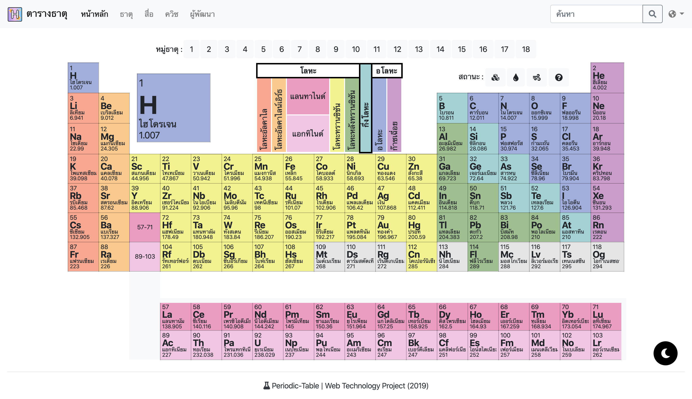
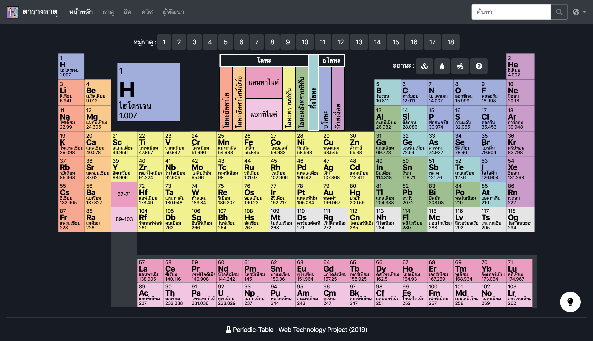
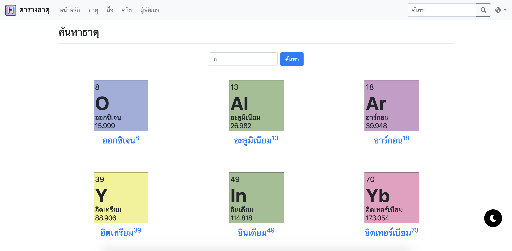
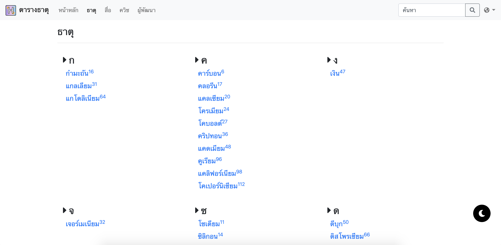
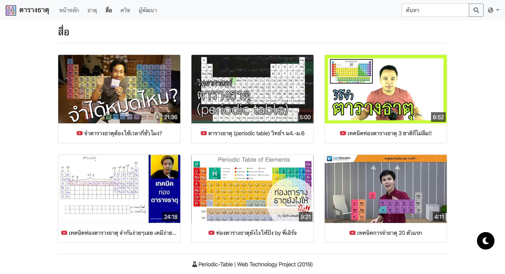
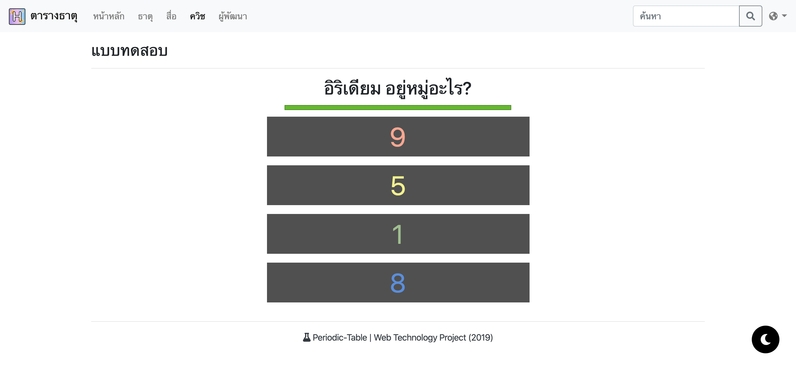
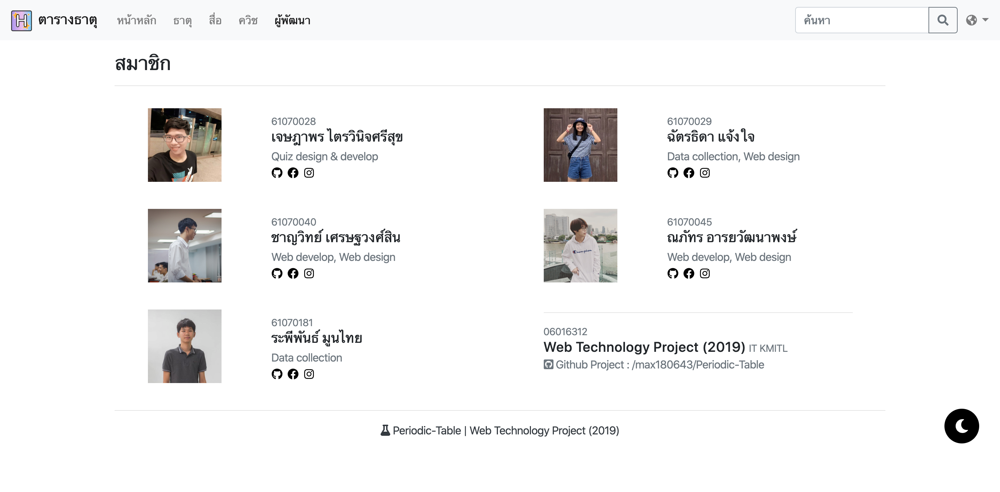

# Periodic-Table
This repository consists of codes of "Web Technology (Web-Tech)" Project, Faculty of Information Technology, King Mongkut's Institute of Technology Ladkrabang (KMITL).
### Website : https://periodic-table-project.herokuapp.com/
______
# Abstract
&nbsp;&nbsp;&nbsp;&nbsp;&nbsp;&nbsp;&nbsp; เนื่องจากในปัจจุบันตารางธาตุ เป็นพื้นฐานที่สำคัญและเป็นสิ่งสำคัญสำหรับสายวิชาวิทยาศาสตร์ เช่น วิชาเคมี ตั้งแต่ระดับชั้นมัธยมปลาย จนถึงระดับมหาวิทยาลัย ซึ่งความสำคัญและประโยช์นของตารางธาตุอยู่ที่เราสามารถใช้ความเข้าใจในสมบัติทั่วไปได้อย่างดี แม้ว่าจะไม่คุ้นเคยหรือรู้จักธาตุนั้นก็ตาม ทางผู้จัดทำจึงได้ปรึกษาและได้ความว่าเป็นเรื่องที่น่าสนใจ มีกลุ่มเป้าหมายที่ดี และเป็นประโยชน์อย่างมาก ซึ่งเป็นการออกแบบตารางธาตุจากที่ส่วนใหญ่จะพบเห็นในหนังสือ หรือ เป็นรูปภาพทั่ว ๆ ไป ซึ่งได้ออกแบบมาในรูปแบบของเว็บไซต์ที่มีโครงสร้างของเว็บเป็นตารางธาตุ มีโครงสร้างที่เข้าใจง่าย และมี 2 ภาษา สามารถเข้าถึงได้ง่ายกว่าการดูในหนังสือ และสามารถเปิดดูในโทรศัพท์ หรือ แท็บเล็ตได้ มีความสะดวกสบายในการใช้งาน ทำให้เป็นที่น่าสนใจของกลุ่มเป้าหมายมากยิ่งขึ้น
______
# Objective
* เพื่อให้ตัวผู้ศึกษาเข้าใจในเรื่องตารางธาตุ
* เพื่อเป็นประโยชน์แก่นักเรียน นักศึกษาในการศึกษาเกี่ยวกับธาตุต่าง ๆ
* เพื่อพัฒนาสื่อการเรียนการสอนที่เกี่ยวกับตารางธาตุ
* เพื่อประหยัดเวลาในการศึกษามากขึ้น
* เพื่อเป็นการบูรณาการระหว่างเทคโนโลยีทางการศึกษาและวิชาเคมี
______
# Preview
### • Table

### • Dark Mode

### • Search

### • Element list

### • Media

### • Quiz

### • Developer

### ** All pages supporting Dark Mode and English language **
______
# Team Member
||||||
|:-----:|:-----:|:-----:|:-----:|:-----:|
|[hashtagSELFIE](https://github.com/hashtagSELFIE)|[chattida](https://github.com/chattida)|[max180643](https://github.com/max180643)|[NAPATKRUP](https://github.com/NAPATKRUP)|[rapeeza1598](https://github.com/rapeeza1598)|
#### รายชื่อสมาชิก
- นาย เจษฎาพร ไตรวินิจศรีสุข 61070028
- นางสาว ฉัตรธิดา แจ้งใจ 61070029
- นาย ชาญวิทย์ เศรษฐวงศ์สิน 61070040
- นาย ณภัทร อารยวัฒนาพงษ์ 61070045
- นาย ระพีพันธ์ มูนไทย 61070181